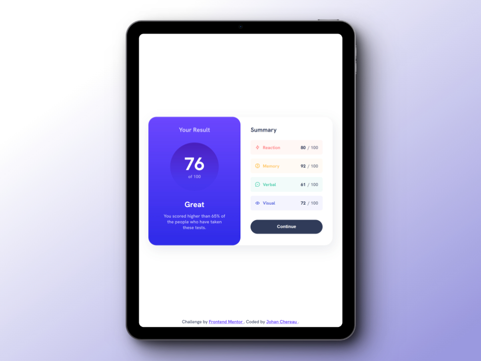

# Frontend Mentor - Results summary component solution

This is a solution to the [Results summary component challenge on Frontend Mentor](https://www.frontendmentor.io/challenges/results-summary-component-CE_K6s0maV). Frontend Mentor challenges help you improve your coding skills by building realistic projects.

## Table of contents

- [Overview](#overview)
  - [The challenge](#the-challenge)
  - [Design](#design)
  - [Screenshots](#screenshots)
  - [Links](#links)
- [My process](#my-process)
  - [Built with](#built-with)
  - [What I learned](#what-i-learned)
  - [Useful resources](#useful-resources)
- [Author](#author)
- [Acknowledgments](#acknowledgments)

## Overview

### The challenge

Users should be able to:

- View the optimal layout depending on their device's screen size
- See hover and focus states for interactive elements

### Design

#### Design to integrate


### Screenshots

#### Mobile view


#### Tablet view



#### Laptop view


### Links

- Solution on Front End Mentor: [Click here](https://www.frontendmentor.io/solutions/responsive-results-summary-semantic-html-and-css-grid-flexbox-bem-eKaYTvgGpj)
- Live Site URL: [Click here](https://johanchereau.github.io/results-summary-component-main/)

## My process

### Built with

- Semantic HTML5 markup
- CSS custom properties
- Flexbox
- CSS Grid
- Mobile-first workflow
- BEM (Block, Element, Modifier)

### What I learned

- How to import local fonts:

```css
@font-face {
  font-family: 'HankenGrotesk';
  font-display: swap;
  font-weight: 100 900;
  src: url(assets/fonts/HankenGrotesk-VariableFont_wght.ttf) format(truetype);
}
```

I would like to learn more about the use of local fonts, and in particular variable fonts in .woff and .woff2 format.

### Useful resources

- [MDN Docs : Fontface](https://developer.mozilla.org/fr/docs/Web/CSS/%40font-face) - Documentation for importing local fonts.
- [CSS-Tricks : CSS Grid](https://css-tricks.com/snippets/css/complete-guide-grid/) - Guide to all CSS grid properties, with examples.
- [CSS-Tricks : Flexbox](https://css-tricks.com/snippets/css/a-guide-to-flexbox/) - Guide to all Flexbox properties, with examples.

## Author

- Frontend Mentor - [@JohanChereau](https://www.frontendmentor.io/profile/JohanChereau)

## Acknowledgments

- [Kevin Powell - Youtube](https://www.youtube.com/@KevinPowell)
